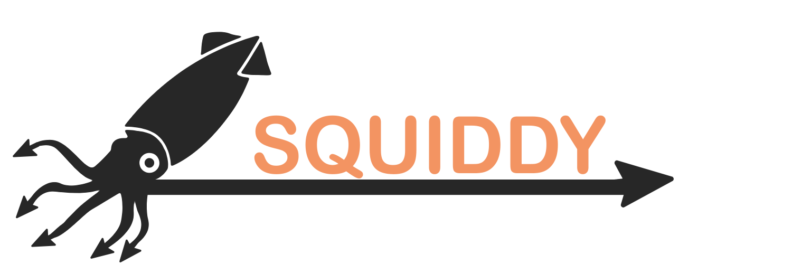
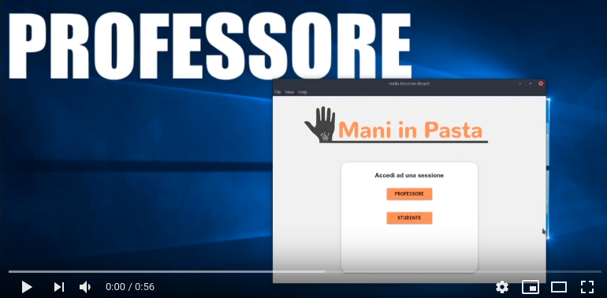

# Mani in pasta

Mani in pasta è il progetto che abbiamo realizzato in occasione dell'Hackathon organizzato da OpenFiber in occasione
della Milano Digital Week.

## L'idea

Ci siamo accorti che, durante la pandemia, le scuole e le università hanno dovuto interrompere molte attività di laboratorio.
Infatti, anche se esistono simulatori online per esperimenti di fisica, chimica e molto altro, quasi tutti sono pensati
per essere utilizzati da soli.

La nostra idea aggiunge a questi siti web un sistema di collaborazione, affiancato da videochiamata. Questo permette
a professori di fare lezioni teoriche introduttive, e successivamente di dividere gli studenti in gruppi che potranno
lavorare in contemporanea, attraverso uno spazio di lavoro condiviso.

### Espansione dell'idea

In futuro, sarà possibile riutilizzare la piattaforma per la formazione professionale di dipendenti o per permettere a software house
di far provare i loro software a futuri clienti senza che essi debbano installare il programma finale sul loro computer.

## Prototipo

Il prototipo è stato realizzato utilizzando Electron, React e WebRTC.
La demo permette di ad un professore di creare una sessione, visualizzare gli studenti che accedono e avviare la sessione, specificando l'url del simulatore da utilizzare.
Gli studenti accedono ad una sessione ed entrano in una sala di attesa, fino a quando il professore non avvia la lezione.
Una volta avviata la lezione, i pc dei ragazzi caricano una pagina web dedicata ad una videochiamata di gruppo, e un pc per gruppo (chiamato host) apre anche la pagina del simulatore.
I rimanenti pc del gruppo iniziano una connessione WebRTC verso l'host per ricevere in streaming la condivisione dello schermo della finestra contenente il simulatore.
Eventi del mouse e della tastiera vengono poi inoltrati al pc dell'host.

